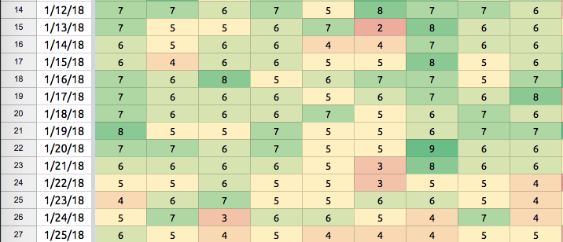

# Daily Rate Bot
> This bot is a fork of Groupme Bot Starter: https://github.com/ACMatUC/groupme-bot-starter

This bot logs rates for days on a scale from 0 to 10 for members of a GroupMe group chat. For example, if a member had a very good day, they may rate it an 8 or a 9, whereas if they had a bad day they may rate it 2 or 3. Rates are logged in a Google sheet. The bot runs on Heroku, a cloud platform.

## Core Commands

### /rate

Usage: /rate [rate]

[rate] is a number from 0 to 10

Ex: /rate 5

This command logs a rate into the sheet for the previous day. Days may only be rated after day is over, i.e. after midnight. If a user rates a day again after already rating that day, then the old rate is overwritten with the new rate, and the bot sends a message detailing the rate change.

### /ratedate (or /daterate)

Usage: /ratedate [rate] [date]

[rate] is the rate, and [date] is a string formatted mm/dd/yyyy (leading zeros not required).

Ex: /rate 5 1/14/2018 

This command is used if members want to rate a day other than the previous day. The bot prevents rating before the sheet's start date and rating into the future.

### /missing

A command with no arguments, /missing lists all the days the user has yet to rate. This command is useful if a user has been away from the chat for a few days and wants to quickly see what rates they need to make up.

### /missing all

This command lists the days missing for everyone involved in the chart.
